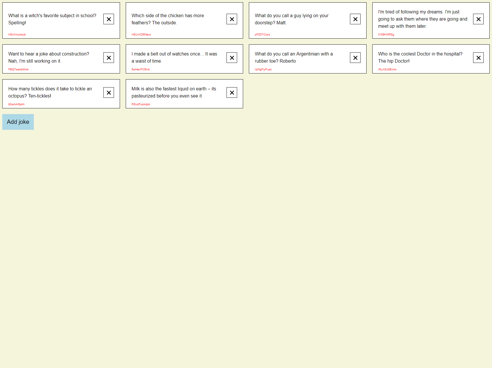

This project was bootstrapped with [Create React App](https://github.com/facebook/create-react-app).

## Brief

A junior developer has submitted the code in this project for our joke generator app. It is full of bugs and does not match the design team's specifications. You have been asked to make the project ready for review so it can be deployed to production as soon as possible.

The design is provided below:

It must:
* On clicking a button fetch dad jokes from the api and append them to the list.
* Display the jokes in a grid of four.
* Each joke must be able to be removed.
* Match the design as closly as possible.

#### Extra Information

Only the latest browsers need to be supported. Supporting IE 11 is NOT necessary.
The design only needs to support desktop devices. If you wish to make the design compatible for mobile and tablet, feel free.
